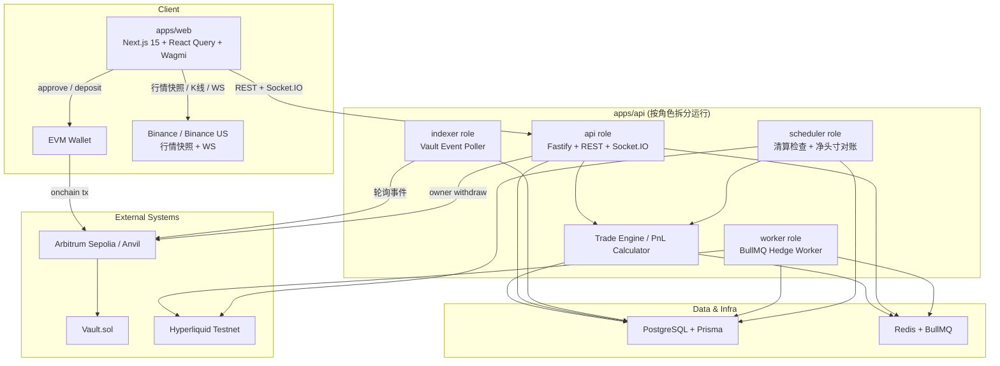

# PerpDex MVP 当前架构说明

> 文档版本：2.0
> 更新日期：2026-03-13
> 状态：基于当前代码实现重写

本文描述的是当前仓库已经落地的系统架构，而不是最初的目标设计。项目现在已经从“单体 MVP 草图”演进成一套混合架构：

- 链上负责资金托管
- 后端负责场内账本、风控、对冲编排
- Hyperliquid 负责外部风险对冲
- 前端同时接入 API、钱包、Binance 行情源

当前产品仍然是一个简化的 CFD / 永续交易 MVP，范围主要包括：

- 单保证金资产：`USDC`
- 单交易标的：`BTC`
- 订单类型：`MARKET`
- 账户模型：用户可持有多条独立仓位记录，非订单簿撮合

---

## 1. 系统架构

### 1.1 架构总览



### 1.2 运行时视图

`apps/api` 不是单一进程。它通过 `APP_ROLES` 拆成四类运行角色：

- `api`：对外提供 REST 和 Socket.IO
- `worker`：消费 BullMQ 对冲任务并下单到 Hyperliquid
- `scheduler`：执行定时清算检查和净头寸对账
- `indexer`：轮询 Vault 的 `Deposit/Withdraw` 事件并同步账本

这意味着当前系统更接近“共享代码库的多角色后端”，而不是旧文档里的单体 API。

### 1.3 核心架构特点

- 资金状态是混合式的：链上 Vault 保存真实托管资产，PostgreSQL 保存交易账本和业务状态。
- 风险管理是异步的：用户成交先在本地账本落地，再异步创建对冲任务。
- 行情链路已经分叉：交易执行和风控价格主要由后端 `MarketService` 获取，前端展示行情主要依赖 Binance。
- 实时能力以账户域为主：Socket.IO 目前主要推送余额和仓位更新，不是前端主行情源。

---

## 2. 模块划分

### 2.1 Monorepo 结构

| 模块 | 路径 | 当前职责 |
| --- | --- | --- |
| Web 前端 | `apps/web` | 钱包接入、登录、交易页、资产页、充值提现页、历史页 |
| API 后端 | `apps/api` | 鉴权、账本查询、下单/平仓、提现、健康检查、Socket.IO |
| 合约 | `apps/contracts` | Vault 合约、部署脚本、Foundry 测试 |
| 共享协议 | `packages/shared` | Zod schema、共享领域类型、对冲任务协议 |
| 合约包 | `packages/contracts` | 目前仅保留占位导出，尚未成为 ABI 的单一来源 |

### 2.2 前端模块

前端技术现实已经不是第一版文档里的 `Zustand` 架构，而是：

- `Next.js 15 App Router`
- `React Query` 负责服务端状态缓存
- `wagmi + Reown AppKit` 负责钱包连接和链交互
- 自定义 hooks 负责业务编排

主要模块如下：

| 模块 | 位置 | 职责 |
| --- | --- | --- |
| 页面层 | `apps/web/app/*` | 交易、资产、充值、提现、历史页面 |
| 业务 hooks | `apps/web/hooks/*` | 登录、余额、仓位、订单历史、充值、提现 |
| API 封装 | `apps/web/lib/api.ts` | JWT 注入、重试、错误处理 |
| 交易 API | `apps/web/lib/trading-api.ts` | 下单和市场接口封装 |
| 实时层 | `apps/web/lib/socket.ts` | 账户域 Socket.IO 订阅 |
| 行情层 | `apps/web/hooks/use-binance-price.ts` | Binance WebSocket + 快照轮询兜底 |
| 链交互 | `apps/web/lib/contracts.ts` | Vault / USDC ABI 与地址配置 |

补充说明：

- 前端充值直接发起链上 `approve + deposit`，不经过后端中转。
- 前端行情图表和盘口展示当前主要来自 Binance，而不是后端 Socket。
- `apps/web/lib/socket.ts` 预留了 `candles`、`notification` 等订阅协议，但后端目前主要实现的是 `market` / `position` 房间，其中前台真正使用稳定的是 `position` 和 `balance`。

### 2.3 后端模块

后端按“路由层 -> 服务层 -> 引擎层 -> 异步任务层 -> 基础设施层”组织。

| 模块 | 位置 | 职责 |
| --- | --- | --- |
| 路由层 | `apps/api/src/routes/*` | 暴露鉴权、用户、交易、对冲任务、健康检查接口 |
| 服务层 | `apps/api/src/services/*` | SIWE 登录、余额查询、价格获取、提现处理 |
| 引擎层 | `apps/api/src/engines/*` | 交易落账、PnL 计算、清算价格和风险等级计算 |
| 队列层 | `apps/api/src/queue/*` | BullMQ 队列、DLQ、重试和优先级定义 |
| Worker | `apps/api/src/workers/hedge.worker.ts` | 调用 Hyperliquid 提交对冲单，当前固定串行消费以避免头寸错序 |
| Scheduler | `apps/api/src/jobs/*` | 清算检查、净头寸对账 |
| Indexer | `apps/api/src/indexer/*` | 轮询 Vault 事件、维护区块游标、账本同步 |
| 基础客户端 | `apps/api/src/clients/*` | `viem` 链交互、Hyperliquid SDK 封装 |

### 2.4 数据与账本模型

PostgreSQL 是系统的业务事实来源，核心表包括：

- `users`：钱包地址、SIWE nonce、最近登录时间
- `accounts`：`availableBalance`、`lockedBalance`、`equity`
- `orders`：用户下单和平仓记录
- `positions`：独立持仓记录，状态为 `OPEN/CLOSED/LIQUIDATED`
- `transactions`：充值、提现、保证金锁定/释放、PnL、清算流水
- `hedge_orders`：对冲任务持久化状态机
- `block_cursors`：indexer 断点续传游标

这里的关键点是：对冲任务状态并不只存在于 Redis/BullMQ 中，而是会先写入 `hedge_orders`，再投递到队列，所以系统重启后仍能保留业务态。

### 2.5 合约模块

`Vault.sol` 当前非常克制，只做三件事：

- 接收用户 `deposit`
- 由 `owner` 执行 `withdraw(user, amount)`
- 发出 `Deposit / Withdraw` 事件给 indexer 同步

这说明当前提现不是 permissionless 模式，而是“平台控制链上出金”的运营模型。

---

## 3. 数据流

### 3.1 登录流

```text
前端钱包地址
  -> 调用 /api/auth/challenge
  -> 后端生成 SIWE challenge，并把 nonce 写入 users
  -> 用户签名
  -> 调用 /api/auth/verify
  -> 后端校验 message / nonce / chainId / domain
  -> 返回 JWT
  -> 前端保存 accessToken，并初始化用户态与查询缓存
```

特点：

- 登录依赖 SIWE 和 JWT，没有服务端 session 存储。
- 用户第一次登录时会自动创建 `USDC` 账户。

### 3.2 充值流

```text
前端调用钱包 -> approve USDC -> deposit(Vault)
  -> Vault 发出 Deposit 事件
  -> indexer 轮询到事件
  -> EventHandler 做幂等校验
  -> 更新 accounts.availableBalance / equity
  -> 写入 transactions(DEPOSIT)
  -> 前端下一次查询或实时刷新后看到余额变化
```

特点：

- 充值成功的业务确认以链上事件为准，而不是以前端交易回执为准。
- indexer 使用 `block_cursors` 做断点续传，避免服务重启后重复或漏处理。

### 3.3 开仓流

```text
前端 POST /api/trade/order
  -> TradeEngine 获取标记价格
  -> 校验余额、数量、保证金
  -> 数据库事务内：
     1. availableBalance 减少
     2. 写入 transactions(MARGIN_LOCK)
     3. 写入 orders
     4. 写入 positions
     5. 汇总更新 lockedBalance
     6. 写入 hedge_orders(PENDING)
  -> API 返回成交结果 + hedgeTaskId
  -> 异步投递 BullMQ
  -> Hedge Worker 向 Hyperliquid 下反向对冲单
  -> 更新 hedge_orders 状态
  -> Socket.IO 推送 balance / position 更新
```

特点：

- 用户订单在本地账本中同步成交，不等待 Hyperliquid 成功才返回。
- 这是“先成交、后对冲”的架构，换取低延迟，但引入短暂风险敞口。

### 3.4 平仓流

```text
前端 DELETE /api/trade/positions/:id
  -> TradeEngine 获取当前价格并计算 realized PnL
  -> 数据库事务内：
     1. position 标记为 CLOSED
     2. 写入反向 close order
     3. 释放原锁定保证金
     4. availableBalance 增加 margin +/- pnl
     5. 写入 MARGIN_RELEASE / REALIZED_PNL 流水
     6. 写入 hedge_orders(CLOSE)
  -> 异步投递对冲任务
  -> Socket.IO 推送仓位和余额变化
```

特点：

- 平仓盈亏先在平台账本完成结算，再由 worker 去关闭外部对冲头寸。

### 3.5 清算流

```text
scheduler 每 5 分钟扫描 OPEN positions
  -> 读取市场价格
  -> PnL Calculator 判断是否触发清算
  -> TradeEngine.liquidatePosition
  -> position 标记 LIQUIDATED
  -> lockedBalance 按剩余仓位重新汇总
  -> 写入 transactions(LIQUIDATION)
  -> 写入高优先级 hedge_orders
  -> worker 用 reduce-only 方式在 Hyperliquid 平仓
```

特点：

- 当前清算是批处理调度，不是 tick 级实时风控。
- 清算优先级高于普通对冲任务。

### 3.6 提现流

```text
前端 POST /api/user/withdraw
  -> WithdrawService 校验 availableBalance
  -> 数据库事务内先扣减 availableBalance，写入 transactions(WITHDRAW, PENDING)
  -> 后端异步调用 Vault.withdraw(user, amount)
  -> 写入 txHash，等待链上确认
  -> indexer 处理 Withdraw 事件
  -> 确认后更新 equity，并将提现流水改为 CONFIRMED
```

特点：

- 提现是“先扣减可用余额，再异步链上执行”。
- 链上确认由 indexer 完成最终记账闭环。
- 如果链上调用失败，服务会尝试回滚 `availableBalance`。

### 3.7 行情与实时流

当前项目存在两套行情路径：

1. 前端展示行情

```text
Binance WebSocket / REST
  -> Next.js /api/binance/* proxy
  -> useBinancePrice / useMarket
  -> 图表、最新价、资产估值
```

2. 后端执行行情

```text
TradeEngine / LiquidationJob
  -> MarketService
  -> Hyperliquid mark price
  -> 失败时回退 Binance REST
```

这意味着“用户看到的行情源”和“后端用于成交/风控的行情源”当前并不完全相同，这是现实现状，需要在后续版本统一。

---

## 4. 关键设计权衡

### 4.1 链上托管 + 场内账本

选择：

- 资金进出通过 Vault 结算
- 交易和风控通过 PostgreSQL 内部账本处理

收益：

- 用户资金托管和交易撮合解耦，交易不需要逐笔上链
- 能快速实现保证金交易、PnL 结算和异步风控

代价：

- 需要维护链上余额与场内账本的一致性
- 需要 indexer、幂等键、对账任务来弥补最终一致性问题

### 4.2 单代码库多角色后端，而非微服务

选择：

- `apps/api` 通过 `APP_ROLES` 分拆为 `api / worker / scheduler / indexer`

收益：

- 保持共享模型、共享 Prisma schema、共享配置，开发和部署成本低
- 又能把同步请求链路和异步任务链路隔离开

代价：

- 角色之间仍然共享代码和数据库，边界比真正微服务弱
- 故障隔离和独立扩缩容能力有限

### 4.3 先落账、后对冲

选择：

- 用户下单先在本地事务内成交，再异步提交 Hyperliquid 对冲

收益：

- API 响应快，用户体验好
- 对冲失败可通过 `hedge_orders + DLQ` 追踪和补偿

代价：

- 存在短时间净风险暴露
- 必须依赖对账任务持续校验平台净头寸和外部头寸是否一致
- 为避免开仓、平仓、清算任务乱序，worker 当前强制 `concurrency = 1`，吞吐量换顺序一致性

### 4.4 前端行情与后端执行行情分离

选择：

- 前端主行情使用 Binance
- 后端执行价格优先使用 Hyperliquid，失败时回退 Binance

收益：

- 前端行情链路更稳定，且不依赖后端是否提供完整市场接口
- 后端执行更接近真实对冲场所

代价：

- 展示价、执行价、清算价可能存在源差异
- 文档、监控和排障复杂度上升

### 4.5 平台控制提现，而不是用户直提

选择：

- Vault 的 `withdraw` 是 `onlyOwner`
- API 异步代用户执行链上出金

收益：

- 可以把链上出金和场内账本校验绑定起来
- 有利于风控、审计和故障回滚

代价：

- 引入平台托管信任假设
- 提现链路更长，依赖后端服务和私钥配置

### 4.6 受控的 MVP 范围

当前实现主动收敛了问题空间：

- 只有 `BTC`
- 只有 `USDC`
- 只有 `MARKET`
- 持仓模型仍然是简化版
- 清算检查是定时任务，不是实时风险引擎

这使系统可以先完成“登录 -> 充值 -> 开仓 -> 平仓/清算 -> 提现 -> 对冲”的业务闭环，但也意味着它还不是一个完整的通用永续合约交易平台。

---

## 5. 当前架构结论

PerpDex 当前已经不是第一版文档中的“前端 + API + 合约”三层结构，而是一个更真实的混合交易系统：

- 前端承担钱包交互和行情展示
- 后端承担账本、风控、提现编排和对冲编排
- Redis/BullMQ 承担异步任务
- Indexer 负责链上到账本同步
- Hyperliquid 承担外部风险对冲

### 5.1 已知项目限制

- K 线数据源与市场数据源当前未完全对齐。前端图表 K 线主要来自 Binance `/api/binance/klines` 代理，而交易页最新价、后端执行价和风控价分别可能来自 Binance 实时 ticker、Hyperliquid mark price 及其回退链路，因此页面展示、下单成交、清算判断之间可能出现短时价格偏差。

如果后续继续演进，最值得优先收敛的三个方向是：

1. 统一前后端行情源，减少展示价与执行价偏差
2. 让 `packages/contracts` 成为 ABI/地址的单一来源
3. 把清算、对账、对冲失败补偿从“任务驱动”提升到更完整的风控与运营闭环
